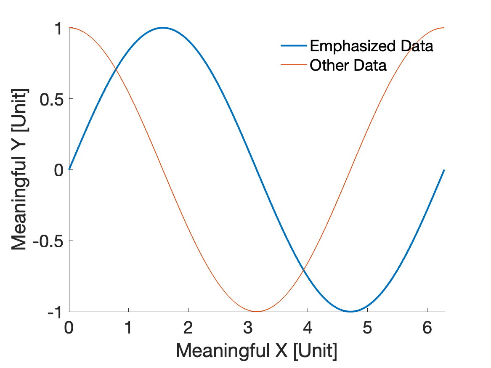

# SCUID-APL
This is a repository for all data collecting and processing scripts used on the SCUID.

## Table of Contents
- [SCUID-APL](#scuid-apl)
  * [Plotting Standard](#plotting-standard)
  * [File and Folder Organization Guide](#file-and-folder-organization-guide)
  * [Experiment Folder Format Quick Reference](#experiment-folder-format-quick-reference)

## Plotting Standard
All plots created with MATLAB should be visually consistent so that they are easy to read and suitable for presentation slides. See below for a general guideline.
- Font size should be 20 points for all text fields in a figure.
- The `x` and `y` axes should be labelled with the quantity they represent. Units should also be included when applicable, surrounded by square brackets (e.g. `Time [s]`).
- There should be a legend on all plots.
- Remove the border lines surrounding the axes and legend. See example code below if you don't know how to do this.
- Use a line width of 2 for emphasized data, and 1 for everything else.
- When making response vs. concentration plots, use dashed lines.
- Do not include a title on a plot if it is meant to be used on a presentation or a paper. You should have a caption for it instead.
- When creating a new figure, make sure you keep the figure handle in a unique variable with sensible name. For example, use `fig_something = figure();` instead of just `figure()`. This will make formatting easier even after the plot has been created.
- You can also use axis handles to add more data onto an existing axis when your loop structure makes it hard to achieve with regular plotting methods. See example code for reference.

Here is a simple example.
```matlab
% Creating a new figure
fig_sin = figure();
% Getting axis handle
tiledlayout(1,1)
ax1 = nexttile;
hold(ax1, "on")
% Plotting the data
x = 0:pi/100:2*pi;
plot(ax1, x, sin(x), LineWidth=2, DisplayName="Emphasized Data")
% Removing box around axis
box off
% Setting font size for the entire figure
fontsize(fig_sin, 20, "points")
% Labelling x and y axes
xlabel("Meaningful X [Unit]")
ylabel("Meaningful Y [Unit]")
% Generating legend box
legend(ax1)
% Removing box around legend
legend boxoff

% To add more data to the same axis
plot(ax1, x, cos(x), LineWidth=1, DisplayName="Other Data")

% Saving figure to computer
filename = "Sample_Plot";
saveas(fig_sin, filename, "png");
```
The resulting plot looks like this.
<p><p/>

## Plot Image File Naming Conventions
- For plots associated with the MFC setup, please check [this documentation](/MFC_Tests/MFC_Plots_Naming_Convention.md).

## File and Folder Organization Guide
We would like to make sure that everybody can find what they want easily, so please organize the files in the following way.
1. Everything should be put somewhere inside the `SCUID-APL` folder. If you are using GitHub Desktop, this folder should be under `Documents/GitHub/` on your local machine, unless you customized it while cloning the repository.
2. Under `SCUID-APL`, you will see several folders, named in the format `{Setup}_Test_{XXX}`. These folders are named after the types of experiment, so they should only contain files related to that experiment. For instance, if you collected some data on the MFC setup, and you exposed the chips to Nitric Oxide, the data files should be stored somewhere inside `MFC_Test_NO`, and **not** under `MFC_Test_NO2`.
3. Under each type of experiment, you need to create a new folder for each new run of the experiment. Usually, we don't have more than one set of new data every day, so name the folder following a specific template. Since each setup requires different settings, the format is also different. A detailed [template](#experiment-folder-format-quick-reference) for each type of experiment can be found at the end of this document. Together with your raw data files or scripts, you should also include a `README.md` file that includes all the details of a particular experiment run. If you have results of the data analysis, such as plot images, they should also be put in the same folder. Create a subfolder `Results` if you got more than one image. 


## Experiment Folder Format Quick Reference

| Experiment Type | Format  | Example |
| --------------- | ------  | ------- |
| MCF Test        |         |         |
| SCUID Test      |         |         |
| Salinity Test   |         |         |

